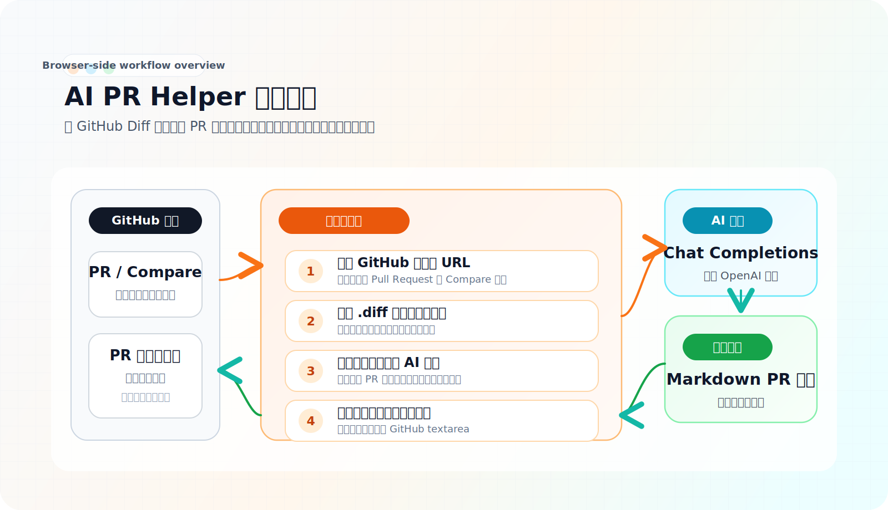

# AI PR Helper

一个面向 GitHub Pull Request 场景的浏览器扩展。

它会读取当前 PR 或 Compare 页面的 Git Diff，调用兼容 OpenAI Chat Completions 协议的 AI 接口生成结构化 PR 描述，并支持一键回填到 GitHub 的描述输入框里。整个流程都发生在浏览器侧，适合个人开发者和小团队先快速建立更统一的 PR 描述方式，提升提 PR 和代码审查的效率。

## 项目定位

很多团队的 PR 描述问题，不只是“写起来麻烦”，还包括“每个人写法都不一样”。

一方面，它确实很重复：

- 改了什么
- 为什么改
- 影响到哪里
- 评审时应该重点看什么

另一方面，尤其在小团队里，如果没有约定好的 PR 模版或描述标准，大家往往会各写各的：

- 有人写一句话就提交
- 有人写很多细节，但缺少结构
- 有人会写影响范围，有人完全不写
- Reviewer 每次都要重新理解这次 PR 应该怎么看

`AI PR Helper` 想解决的，不只是这类机械劳动，也是在团队里提供一个更稳定的 PR 描述基线。它不是要替代工程判断，而是把“整理 Diff 并组织成文字”的那一步自动化，并尽量按统一结构输出，让你更快得到一份可继续人工润色、也更利于评审的初稿。

## 核心能力

- 自动识别 GitHub PR 页面和 Compare 页面
- 自动推导并抓取当前页面对应的 `.diff`
- 将 Diff 发给可配置的 AI 接口生成 PR 描述
- 在弹窗中预览生成结果
- 一键把结果粘贴回 GitHub PR 描述输入框

当前默认生成的内容包含：

- `## 变更概述`
- `## 主要改动`
- `## 影响范围`
- `## 风险与回滚`
- `## 测试说明`

## 使用效果

插件弹窗目前覆盖“生成结果预览”和“接口配置”两个核心场景，界面如下：

<p align="center">
  
  
</p>

典型使用方式如下：

1. 在 GitHub 打开一个 Pull Request 页面，或者 Compare 页面
2. 打开扩展弹窗，点击“`一键生成 PR 描述`”
3. 扩展抓取当前 Diff，并请求已配置的 AI 接口生成总结
4. 你在弹窗中检查结果
5. 点击“`一键粘贴到 PR 描述`”，自动写回 GitHub 编辑框

## 工作原理



核心逻辑目前集中在 [`popup.tsx`](/Users/cc/my-github-ai-helper/popup.tsx)：

- 识别支持的 GitHub 页面
- 请求 Diff 文本
- 调用兼容 OpenAI Chat Completions 的 AI API
- 使用 `chrome.scripting` 将结果写入 GitHub textarea

## 支持的页面

当前主要支持以下地址格式：

- `https://github.com/<owner>/<repo>/pull/<number>`
- `https://github.com/<owner>/<repo>/compare/<base>...<head>`

如果当前页面不是上述两类页面，扩展会提示无法抓取 Diff。

## 快速开始

### 环境要求

- Node.js 18+
- npm
- Chrome 或其他兼容 Chromium 的浏览器
- 可用的 AI API Key

### 1. 安装依赖

```bash
npm install
```

### 2. 启动开发构建

```bash
npm run dev
```

如果你使用 Chrome Manifest V3，本地加载目录通常是：

```bash
build/chrome-mv3-dev
```

### 3. 在浏览器中加载扩展

1. 打开 `chrome://extensions`
2. 开启“开发者模式”
3. 点击“加载已解压的扩展程序”
4. 选择 `build/chrome-mv3-dev`

### 4. 在插件里配置你的 AI 接口

首次打开扩展后，切换到“`设置`”页，填写并保存：

- `API Key`
- `Base URL`（或直接填 `API URL`）
- `Model`

保存时扩展会按你填写的接口域名申请权限。配置仅保存在当前浏览器本地存储中（`chrome.storage.local`）。

## 日常使用

### 生成 PR 描述

1. 打开 GitHub PR 或 Compare 页面
2. 点击扩展图标
3. 确保在“`设置`”页已完成 API 配置
4. 回到“`生成`”页点击“`一键生成 PR 描述`”
5. 等待 AI 返回结果

### 回填到 GitHub

1. 确保 GitHub 页面中已经展开 PR 描述编辑区域
2. 点击“`一键粘贴到 PR 描述`”
3. 扩展会自动填充内容到对应文本框

如果没有找到输入框，通常意味着：

- 当前页面不是 PR 描述可编辑场景
- GitHub 编辑器还没有展开
- GitHub 页面 DOM 结构发生了变化

## 插件内配置项

| 配置项 | 说明 |
| --- | --- |
| `API Key` | 你的模型服务密钥 |
| `Base URL` | 模型服务基础地址，默认建议 `https://api.moonshot.cn/v1` |
| `API URL` | 可选。直接指定完整 `chat/completions` 地址，优先级高于 Base URL |
| `Model` | 调用模型名，例如 `moonshot-v1-8k` |

## 权限说明

项目当前声明了以下扩展权限：

- `tabs`：读取当前活动标签页 URL
- `storage`：保存用户本地配置（API Key / URL / Model）
- `scripting`：向 GitHub 页面注入脚本，用于自动粘贴结果
- `permissions`：运行时按接口域名申请权限

默认站点权限：

- `https://github.com/*`
- `https://patch-diff.githubusercontent.com/*`

可选站点权限（仅在用户保存配置时按目标接口域名申请）：

- `https://*/*`
- `http://*/*`

这些权限分别用于识别 GitHub 页面、抓取 Diff、回填 PR 描述，以及在你授权后请求你自己配置的 AI 接口。

## 项目结构

```text
.
├── assets/               # 图标等静态资源
├── .github/workflows/    # GitHub Actions
├── lib/                  # AI 请求与配置存储逻辑
├── popup.tsx             # 扩展弹窗（生成 + 设置）
├── package.json          # 依赖、脚本、扩展权限
└── README.md
```

## 当前状态

这个项目目前更像一个可用的 MVP，适合继续打磨成真正的开源工具。它已经能完成“抓 Diff -> 生成 PR 描述 -> 自动回填”这条主链路，但还有一些典型的早期项目特征：

- 逻辑主要集中在单文件里，后续可以继续拆分模块
- prompt 已升级为统一 PR 模版，但还没有自定义模板配置能力
- Diff 做了长度截断，超大改动场景下摘要质量可能下降
- API Key 改为用户本地配置，但仍属于前端持有密钥方案，不适合高安全要求场景

如果后续准备把它做成更长期维护的项目，更推荐把 AI 请求迁移到后端服务中处理，同时补充更细粒度的配置和测试。

## Roadmap

- [x] 支持从 GitHub PR / Compare 页面抓取 Diff
- [x] 支持调用可配置 AI 接口生成 PR 描述
- [x] 支持一键粘贴到 GitHub PR 描述框
- [ ] 支持自定义 Prompt / 模板
- [ ] 支持中英文输出切换
- [x] 支持按统一章节生成测试说明、风险说明、回滚说明
- [ ] 支持超长 Diff 分段总结
- [ ] 支持本地保存生成历史
- [ ] 补充更完善的错误提示与可观测性
- [ ] 增加自动化测试

## 适合谁

如果你经常遇到下面这些情况，这个项目会比较顺手：

- 每次提 PR 都要重复写类似结构的描述
- 团队里没有固定的 PR 描述标准，导致每个人写法差异很大
- 想让 PR 内容更整洁，但不想花太多时间整理
- 希望 Reviewer 能更快抓住改动重点，减少来回追问
- 希望直接在 GitHub 页面中完成“生成 + 粘贴”闭环
- 正在探索 AI 在研发流程中的轻量提效工具

## 贡献方式

欢迎继续把这个项目打磨成真正好用的开源工具。比较适合的贡献方向包括：

- 优化生成 Prompt 质量
- 增加更多 GitHub 页面兼容性
- 重构前端结构，拆分当前逻辑
- 增加设置页，支持模板和模型配置
- 补充测试、文档和错误处理

如果你准备接收社区贡献，仓库里现在已经补上了这些基础文件：

- [`LICENSE`](/Users/cc/my-github-ai-helper/LICENSE)
- [`CONTRIBUTING.md`](/Users/cc/my-github-ai-helper/CONTRIBUTING.md)
- [Issue templates](/Users/cc/my-github-ai-helper/.github/ISSUE_TEMPLATE)
- [Pull request template](/Users/cc/my-github-ai-helper/.github/pull_request_template.md)

## 构建与打包

生产构建：

```bash
npm run build
```

打包扩展：

```bash
npm run package
```

仓库中已经存在一个用于提交浏览器商店的 GitHub Actions 工作流：

- [submit.yml](/Users/cc/my-github-ai-helper/.github/workflows/submit.yml)

## 技术栈

- React 18
- TypeScript
- Plasmo
- Chrome Extension APIs
- OpenAI 兼容 Chat Completions API

## 已知限制

- 当前仅支持 GitHub PR / Compare 页面
- 只对页面中可识别到的 PR 描述 textarea 生效
- Diff 内容目前会截断到前 `15000` 个字符
- AI API Key 当前直接暴露在浏览器扩展前端环境中

## License

本项目当前使用 [`MIT License`](/Users/cc/my-github-ai-helper/LICENSE)。
