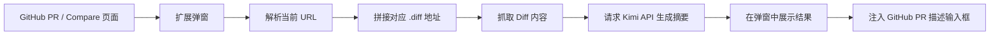

# AI PR Helper

一个面向 GitHub Pull Request 场景的浏览器扩展。

它会读取当前 PR 或 Compare 页面的 Git Diff，调用 Kimi 生成结构化 PR 描述，并支持一键回填到 GitHub 的描述输入框里。整个流程都发生在浏览器侧，适合个人开发者和小团队先快速验证想法、提升提 PR 的效率。

## 项目定位

很多项目的 PR 描述并不难写，但很重复：

- 改了什么
- 为什么改
- 影响到哪里
- 评审时应该重点看什么

`AI PR Helper` 想解决的就是这类机械劳动。它不是要替代工程判断，而是把“整理 Diff 并组织成文字”的那一步自动化掉，让你更快得到一份可以继续人工润色的初稿。

## 核心能力

- 自动识别 GitHub PR 页面和 Compare 页面
- 自动推导并抓取当前页面对应的 `.diff`
- 将 Diff 发给 Kimi 生成 PR 描述
- 在弹窗中预览生成结果
- 一键把结果粘贴回 GitHub PR 描述输入框

当前默认生成的内容包含：

- `## 变更概述`
- `## 主要改动`
- `## 影响范围`
- `## 风险与回滚`
- `## 测试说明`

## 使用效果

典型使用方式如下：

1. 在 GitHub 打开一个 Pull Request 页面，或者 Compare 页面
2. 打开扩展弹窗，点击“`一键生成 PR 描述`”
3. 扩展抓取当前 Diff，并请求 Kimi 生成总结
4. 你在弹窗中检查结果
5. 点击“`一键粘贴到 PR 描述`”，自动写回 GitHub 编辑框

## 工作原理



核心逻辑目前集中在 [`popup.tsx`](/Users/cc/my-github-ai-helper/popup.tsx)：

- 识别支持的 GitHub 页面
- 请求 Diff 文本
- 调用 Moonshot / Kimi Chat Completions API
- 使用 `chrome.scripting` 将结果写入 GitHub textarea

## 支持的页面

当前主要支持以下地址格式：

- `https://github.com/<owner>/<repo>/pull/<number>`
- `https://github.com/<owner>/<repo>/compare/<base>...<head>`

如果当前页面不是上述两类页面，扩展会提示无法抓取 Diff。

## 快速开始

### 环境要求

- Node.js 18+
- npm
- Chrome 或其他兼容 Chromium 的浏览器
- 可用的 Kimi API Key

### 1. 安装依赖

```bash
npm install
```

### 2. 配置环境变量

复制示例配置：

```bash
cp .env.example .env
```

然后填入你的 Kimi API Key：

```bash
PLASMO_PUBLIC_KIMI_API_KEY=your_kimi_api_key_here
```

### 3. 启动开发构建

```bash
npm run dev
```

如果你使用 Chrome Manifest V3，本地加载目录通常是：

```bash
build/chrome-mv3-dev
```

### 4. 在浏览器中加载扩展

1. 打开 `chrome://extensions`
2. 开启“开发者模式”
3. 点击“加载已解压的扩展程序”
4. 选择 `build/chrome-mv3-dev`

## 日常使用

### 生成 PR 描述

1. 打开 GitHub PR 或 Compare 页面
2. 点击扩展图标
3. 点击“`一键生成 PR 描述`”
4. 等待 AI 返回结果

### 回填到 GitHub

1. 确保 GitHub 页面中已经展开 PR 描述编辑区域
2. 点击“`一键粘贴到 PR 描述`”
3. 扩展会自动填充内容到对应文本框

如果没有找到输入框，通常意味着：

- 当前页面不是 PR 描述可编辑场景
- GitHub 编辑器还没有展开
- GitHub 页面 DOM 结构发生了变化

## 环境变量

| 变量名 | 说明 |
| --- | --- |
| `PLASMO_PUBLIC_KIMI_API_KEY` | Kimi API Key，用于调用 Moonshot 接口 |

## 权限说明

项目当前声明了以下扩展权限：

- `tabs`：读取当前活动标签页 URL
- `storage`：预留浏览器本地存储能力
- `scripting`：向 GitHub 页面注入脚本，用于自动粘贴结果

站点权限：

- `https://github.com/*`
- `https://patch-diff.githubusercontent.com/*`

这些权限分别用于识别当前 GitHub 页面、抓取 Diff 和回填 PR 描述。

## 项目结构

```text
.
├── assets/               # 图标等静态资源
├── .github/workflows/    # GitHub Actions
├── popup.tsx             # 扩展弹窗和主要业务逻辑
├── package.json          # 依赖、脚本、扩展权限
└── README.md
```

## 当前状态

这个项目目前更像一个可用的 MVP，适合继续打磨成真正的开源工具。它已经能完成“抓 Diff -> 生成 PR 描述 -> 自动回填”这条主链路，但还有一些典型的早期项目特征：

- 逻辑主要集中在单文件里，后续可以继续拆分模块
- prompt 已升级为统一 PR 模版，但还没有自定义模板配置能力
- Diff 做了长度截断，超大改动场景下摘要质量可能下降
- 直接在前端使用 `PLASMO_PUBLIC_` 环境变量，不适合高安全要求场景

如果后续准备把它做成更长期维护的项目，更推荐把 AI 请求迁移到后端服务中处理，同时补充更细粒度的配置和测试。

## Roadmap

- [x] 支持从 GitHub PR / Compare 页面抓取 Diff
- [x] 支持调用 Kimi 生成 PR 描述
- [x] 支持一键粘贴到 GitHub PR 描述框
- [ ] 支持自定义 Prompt / 模板
- [ ] 支持中英文输出切换
- [x] 支持按统一章节生成测试说明、风险说明、回滚说明
- [ ] 支持超长 Diff 分段总结
- [ ] 支持本地保存生成历史
- [ ] 补充更完善的错误提示与可观测性
- [ ] 增加自动化测试

## 适合谁

如果你经常遇到下面这些情况，这个项目会比较顺手：

- 每次提 PR 都要重复写类似结构的描述
- 想让 PR 内容更整洁，但不想花太多时间整理
- 希望直接在 GitHub 页面中完成“生成 + 粘贴”闭环
- 正在探索 AI 在研发流程中的轻量提效工具

## 贡献方式

欢迎继续把这个项目打磨成真正好用的开源工具。比较适合的贡献方向包括：

- 优化生成 Prompt 质量
- 增加更多 GitHub 页面兼容性
- 重构前端结构，拆分当前逻辑
- 增加设置页，支持模板和模型配置
- 补充测试、文档和错误处理

如果你准备接收社区贡献，仓库里现在已经补上了这些基础文件：

- [`LICENSE`](/Users/cc/my-github-ai-helper/LICENSE)
- [`CONTRIBUTING.md`](/Users/cc/my-github-ai-helper/CONTRIBUTING.md)
- [Issue templates](/Users/cc/my-github-ai-helper/.github/ISSUE_TEMPLATE)
- [Pull request template](/Users/cc/my-github-ai-helper/.github/pull_request_template.md)

## 构建与打包

生产构建：

```bash
npm run build
```

打包扩展：

```bash
npm run package
```

仓库中已经存在一个用于提交浏览器商店的 GitHub Actions 工作流：

- [submit.yml](/Users/cc/my-github-ai-helper/.github/workflows/submit.yml)

## 技术栈

- React 18
- TypeScript
- Plasmo
- Chrome Extension APIs
- Moonshot / Kimi API

## 已知限制

- 当前仅支持 GitHub PR / Compare 页面
- 只对页面中可识别到的 PR 描述 textarea 生效
- Diff 内容目前会截断到前 `15000` 个字符
- Kimi API Key 当前直接暴露在浏览器扩展前端环境中

## License

本项目当前使用 [`MIT License`](/Users/cc/my-github-ai-helper/LICENSE)。
